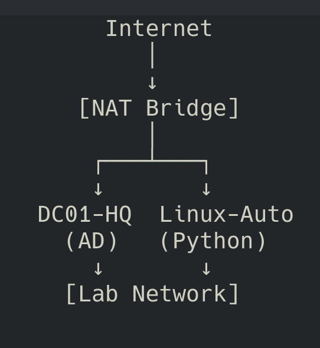
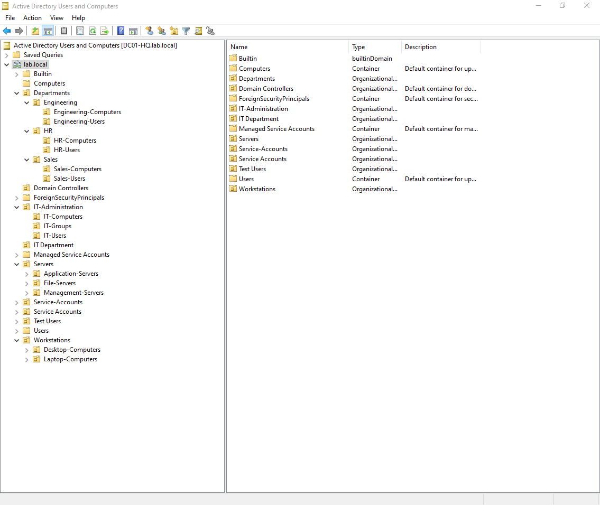
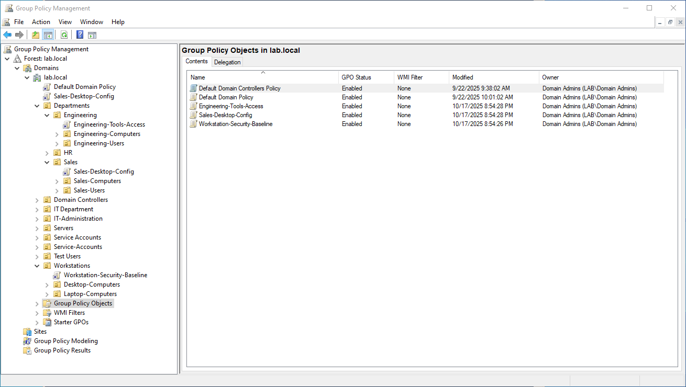
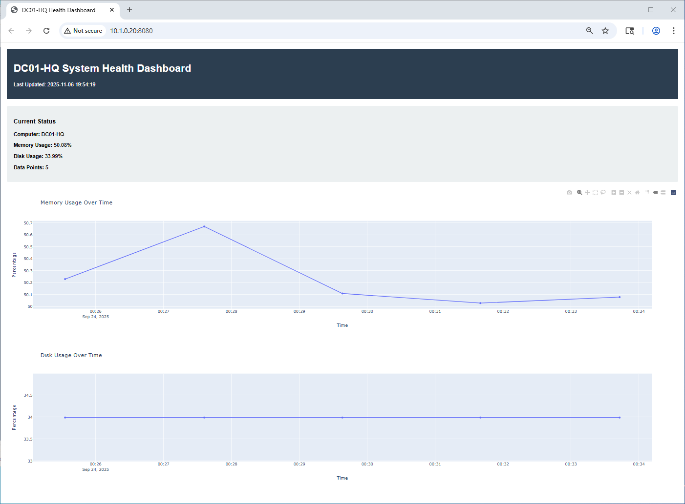
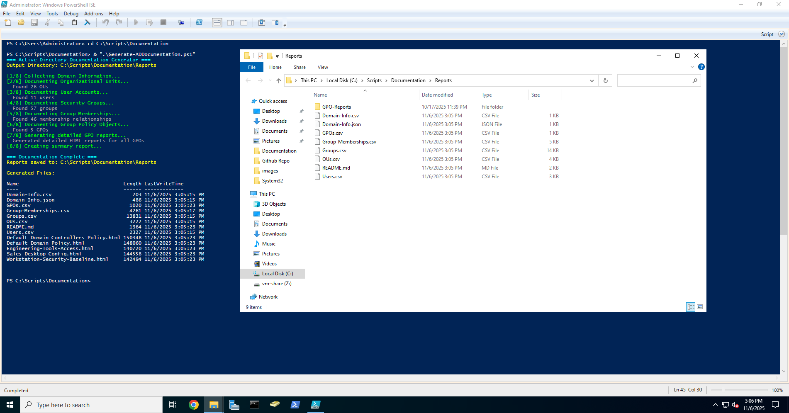

# Active Directory Lab Environment

A comprehensive Active Directory lab environment demonstrating enterprise-level skills in directory services, Group Policy management, PowerShell automation, and cross-platform integration.

## 🎯 Project Overview

This project showcases the design, implementation, and automation of a complete Active Directory infrastructure with cross-platform monitoring and management capabilities.

### Key Features

- ✅ **Enterprise AD Structure** - Multi-tier OU hierarchy with department-based organization
- ✅ **Group Policy Management** - Layered GPO strategy with security baselines
- ✅ **PowerShell Automation** - Automated documentation, reporting, and management
- ✅ **Cross-Platform Integration** - Python-PowerShell integration via WinRM
- ✅ **Real-Time Monitoring** - Web-based dashboard with live system metrics
- ✅ **Automated Documentation** - Self-documenting environment with scheduled reports

## 📊 Environment Statistics

- **Organizational Units**: 20+
- **User Accounts**: 6 test users across departments
- **Security Groups**: 6 role-based and department groups
- **Group Policy Objects**: 3 production GPOs
- **Automation Scripts**: 800+ lines of PowerShell, 500+ lines of Python

## 🏗️ Architecture

### Infrastructure Components

| Component | OS | IP Address | Role |
|-----------|----|-----------|----- |
| DC01-HQ | Windows Server 2022 | 10.1.0.10 | Domain Controller, DNS, DHCP |
| Linux-Auto | Ubuntu 22.04 LTS | 10.1.0.20 | Automation Server, Monitoring |

### Network Design

- **Lab Network**: 10.1.0.0/24 - Domain services and replication
- **Internet Access**: NAT bridge via virbr0 for updates
- **DNS**: Internal DNS with external forwarders (8.8.8.8, 8.8.4.4)

### OU Structure

\\\
lab.local
├── IT-Administration
│   ├── IT-Users
│   ├── IT-Computers
│   └── IT-Groups
├── Departments
│   ├── Sales (Users & Computers)
│   ├── HR (Users & Computers)
│   └── Engineering (Users & Computers)
├── Servers
│   ├── Application-Servers
│   ├── File-Servers
│   └── Management-Servers
├── Workstations
│   ├── Desktop-Computers
│   └── Laptop-Computers
└── Service-Accounts
\\\

## 📸 Environment Screenshots

### Active Directory Organizational Structure

*Enterprise-grade OU hierarchy with department-based organization*

### Group Policy Management

*Layered GPO strategy with security baselines and department policies*

### Real-Time Monitoring Dashboard

*Flask web dashboard showing live system health metrics*

### PowerShell Automation

*Automated documentation generation reducing manual effort by 90%*

## 🔧 Technologies Used

### Infrastructure
- Windows Server 2022 (Active Directory Domain Services)
- Ubuntu 22.04 LTS
- KVM/QEMU Virtualization
- DNS and DHCP Services

### Scripting & Automation
- PowerShell 5.1 (800+ lines)
- Python 3.12 (500+ lines)
- WinRM for remote management
- Bash scripting

### Web Development
- Flask web framework
- Plotly for data visualization
- RESTful API design
- HTML/CSS/JavaScript

### Tools & Platforms
- Visual Studio Code
- Git version control
- virt-manager
- OpenMandriva (host OS)

## 📁 Repository Structure

\\\
AD-Lab-Project/
├── documentation/
│   ├── PORTFOLIO.md          # Detailed project portfolio
│   ├── AD-DIAGRAMS.md        # Visual architecture diagrams
│   └── QUICK-REFERENCE.md    # Quick reference guide
├── scripts/
│   ├── powershell/
│   │   ├── Generate-ADDocumentation.ps1
│   │   └── Get-SystemHealth.ps1
│   └── python/
│       ├── powershell_client.py
│       ├── health_monitor.py
│       └── dashboard.py
├── reports/
│   └── sample-reports/       # Example generated reports
├── images/
│   └── screenshots/          # Environment screenshots
└── README.md
\\\

## 🚀 Key Scripts

### Generate-ADDocumentation.ps1
Automated documentation generator that creates:
- Domain and forest information
- Complete OU structure inventory
- User and group reports
- GPO inventory with detailed HTML reports
- Executive summary in multiple formats

### PowerShell-Python Integration
Cross-platform monitoring system featuring:
- Remote PowerShell execution via WinRM
- Real-time system health collection
- Web dashboard with live charts
- Historical data tracking
- REST API for programmatic access

## 💡 Skills Demonstrated

### Active Directory
- Domain controller deployment and configuration
- OU design following enterprise best practices
- Group Policy creation, linking, and troubleshooting
- User and group lifecycle management
- DNS/DHCP service configuration
- Domain security and authentication

### Automation & Scripting
- Advanced PowerShell scripting
- Python development for systems management
- Cross-platform integration (Linux ↔ Windows)
- API development and integration
- Scheduled task automation
- Error handling and logging

### System Administration
- Windows Server administration
- Linux server management
- Virtualization (KVM/QEMU)
- Network design and implementation
- Service monitoring and alerting
- Technical documentation

## 📸 Screenshots

### Active Directory Users and Computers

### Group Policy Management Console

### Web-Based Monitoring Dashboard

## 🎓 Technical Challenges Solved

### 1. Cross-Platform Authentication
**Challenge**: Enabling secure PowerShell remoting from Linux to Windows domain controller  
**Solution**: Configured WinRM with domain authentication, implemented UPN-based credentials, and established secure communication channels

### 2. Dual Network Architecture
**Challenge**: VMs required both internet access and isolated lab network  
**Solution**: Designed dual-NIC configuration with virbr0 for internet and dedicated 10.1.0.0/24 network for domain services

### 3. Automated Documentation
**Challenge**: Manual documentation becomes outdated quickly in dynamic environments  
**Solution**: Created PowerShell automation that generates comprehensive documentation on-demand in multiple formats

## 📈 Future Enhancements

- [ ] Multi-site AD replication with DC02-Branch
- [ ] Certificate Services (AD CS) implementation
- [ ] Advanced GPO features (WMI filtering, loopback processing)
- [ ] Disaster recovery procedures and testing
- [ ] Azure AD Connect for hybrid identity
- [ ] SIEM integration for security monitoring
- [ ] Automated backup and restoration
- [ ] Additional client VMs for testing

## 📚 Documentation

- **[Full Portfolio](documentation/PORTFOLIO.md)** - Complete project documentation
- **[Architecture Diagrams](documentation/AD-DIAGRAMS.md)** - Visual network and OU diagrams  
- **[Quick Reference](documentation/QUICK-REFERENCE.md)** - Command reference guide

## 🔗 Related Projects

- [PowerShell Automation Scripts](https://github.com/yourusername/powershell-scripts)
- [Python Systems Management](https://github.com/yourusername/python-sysadmin)

## 📝 License

This project is created for educational and portfolio purposes.

## 👤 Author

**Job Morales**
- LinkedIn: [https://www.linkedin.com/in/job-morales/](https://www.linkedin.com/in/job-morales/)
- Email: jobd.morales@gmail.com

## 🙏 Acknowledgments

- Microsoft Learn for Active Directory documentation
- PowerShell community for scripting best practices
- Flask and Python communities for web development resources

---

**Note**: This is a lab environment created for learning and demonstration purposes. Passwords and security configurations shown are for educational use only and should not be used in production environments.

**Last Updated**: 2025-11-05
